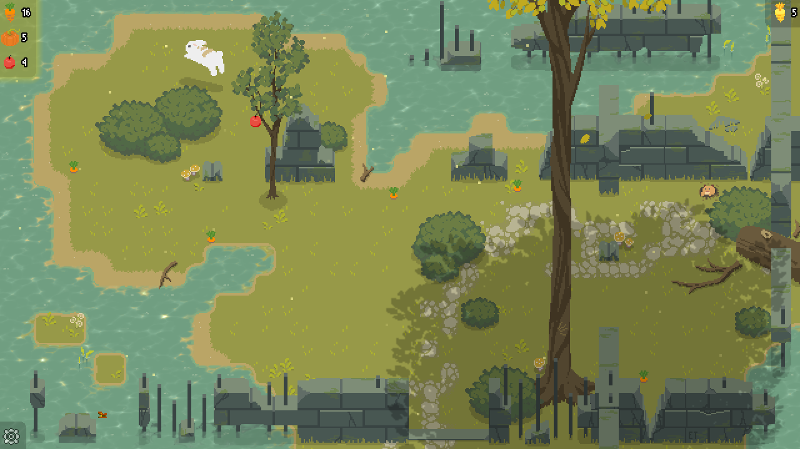
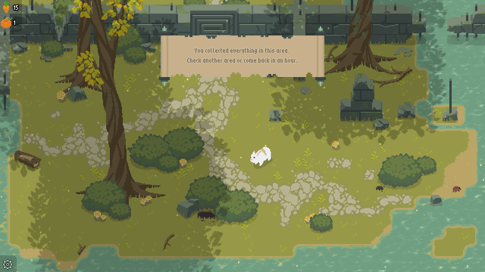
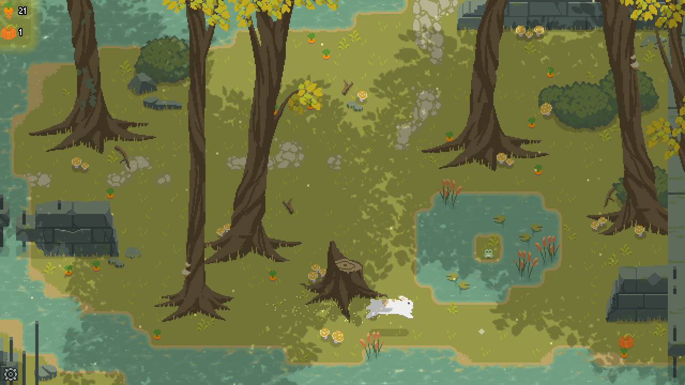
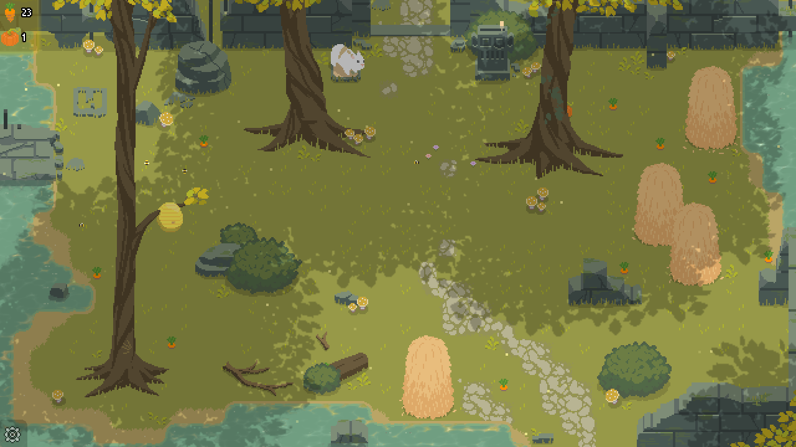
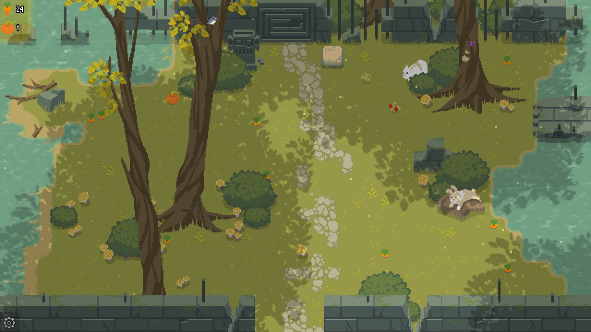

# Bunny Forest

Calm and cute pixel game about bunnies. Hop around, search for carrots, plant flowers, trade and explore the forest.

There are 6 areas to explore and you'll have to work a bit to get into the last 2. There are some  secrets too!🐰

If you ever get stuck because you can't find enough food (it might be hiding behind something), don't worry - any carrots, apples, and pumpkins you eat will regrow in an hour. You don't need to keep the game open either - time passes even while it's closed.

## Links
---
- [Itch.io](https://erytau.itch.io/bunny-forest) (Windows, Linux, Mac, Android APK)
- [Google Play](https://play.google.com/store/apps/details?id=com.erytau.bunnyforest)

## Privacy Policy
---
- [Privacy Policy](./bunny-forest-privacy)

## Gallery
---



