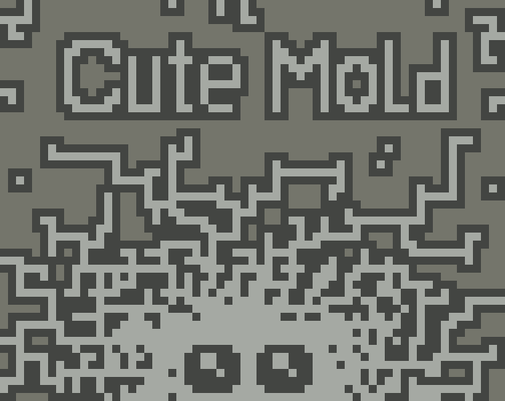
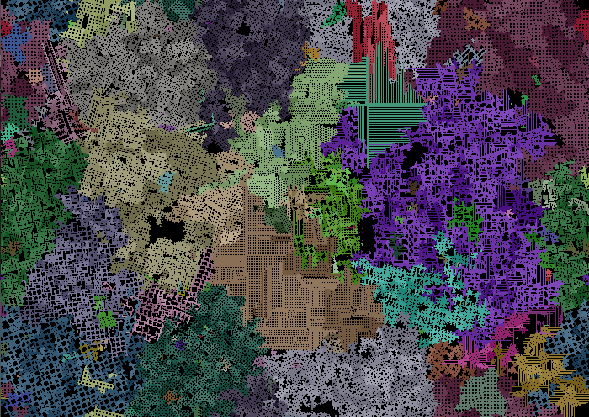
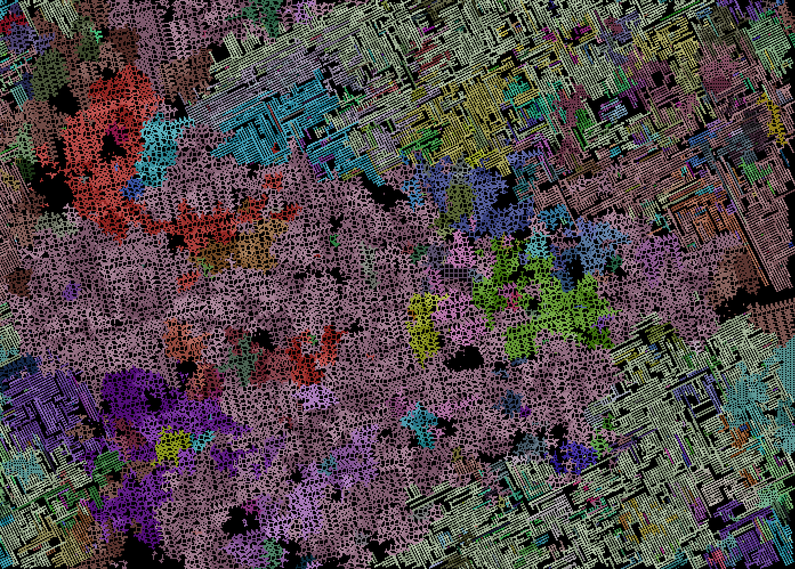
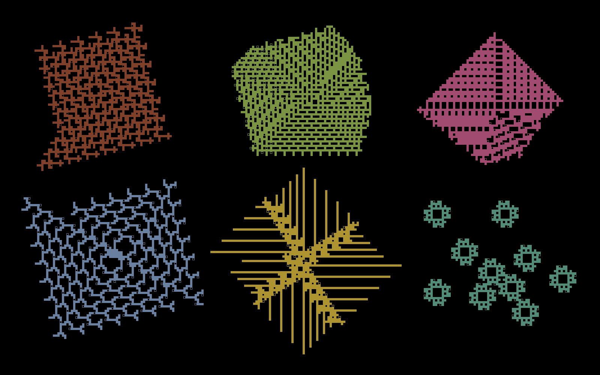

# Cute Mold

Mold growth and evolution simulation. The mold gets energy for the void space around it, so the mold that has more voids will get more energy. Molds cannot interact or damage each other, evolutionary selection goes only by competing for space.

Molds with the same genome have the same color, but different shades. Mold with a mutated genome will get a new color. Cells with black dots are spores.

- G to generate new molds
- D to delete all the molds
- Q/W to decrease/increase energy of the voids
- P to pause
- F to fullscreen
- Mouse wheel to zoom
- Right mouse button to move the screen
- Left mouse click to copy a genome to clipboard
- Click on the empty space to create a new mold with the genome saved in your clipboard

You can share your molds in the comments by pasting their genomes as text! Show off your best molds! To see other people's molds, copy their genome to the clipboard, run the simulation, and click on a void.

Give your molds time to become beautiful. Evolution isn't a quick process!

## Links

- [Itch.io](https://erytau.itch.io/cute-mold) (Windows, Linux, Source)

## Gallery


