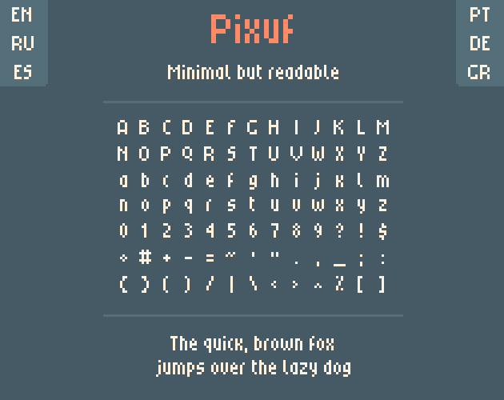
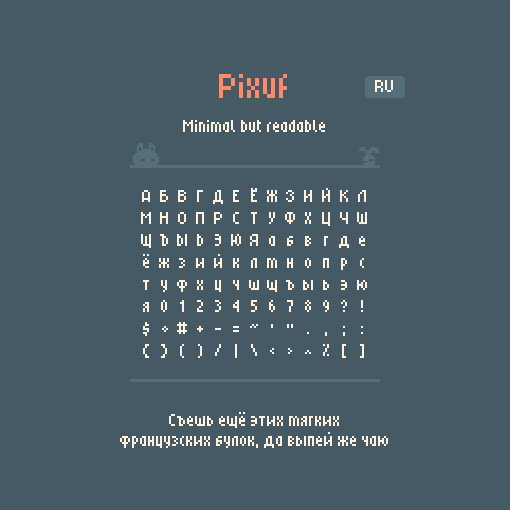
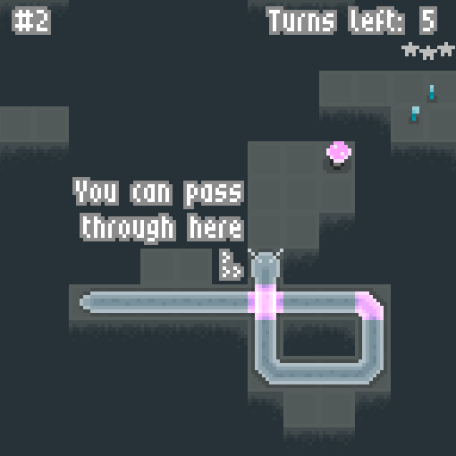
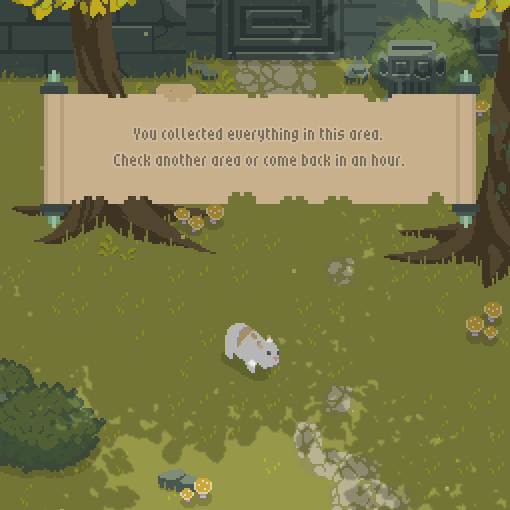

# Pixuf - Tiny Pixel Font

Pixuf is a tiny but, hopefully, readable proportional font. The goal was to make it as tiny as I could while keeping it readable.

Designed for font sizes of 8, 16, 24, 32, etc.

The character set covers English, Spanish, Greek, Portuguese, German, and Russian - uppercase and lowercase. If I missed any characters you need, let me know and I'll try to add them.

- Average width 3
- Ascender height 6
- Descender height 1
- x-height 5

Licensed under CC0, completely free for any purposes.
Attribution isn't required (but appreciated, as are donations).

## Links

- [Itch.io](https://erytau.itch.io/pixuf)

## Gallery

