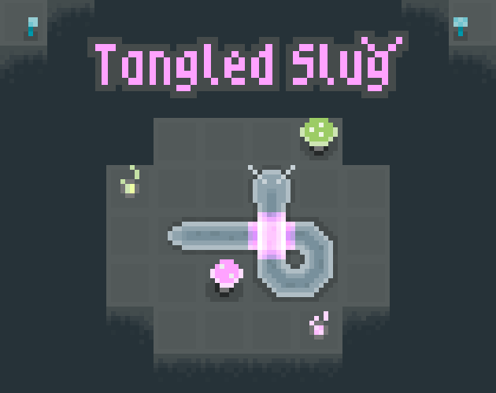
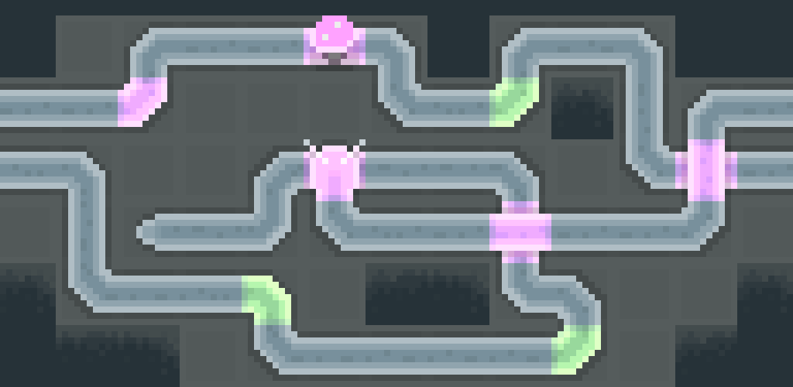
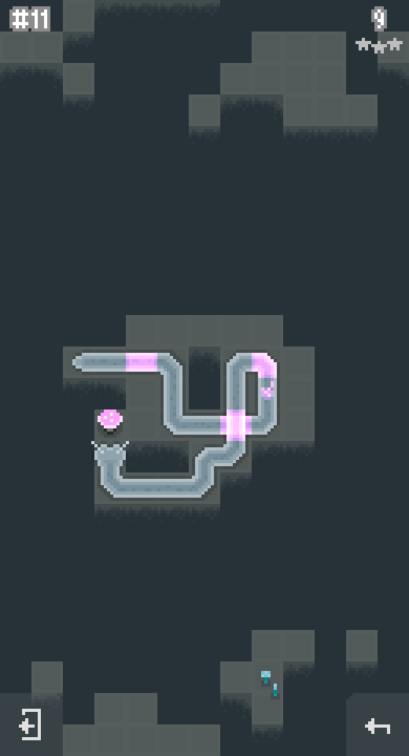
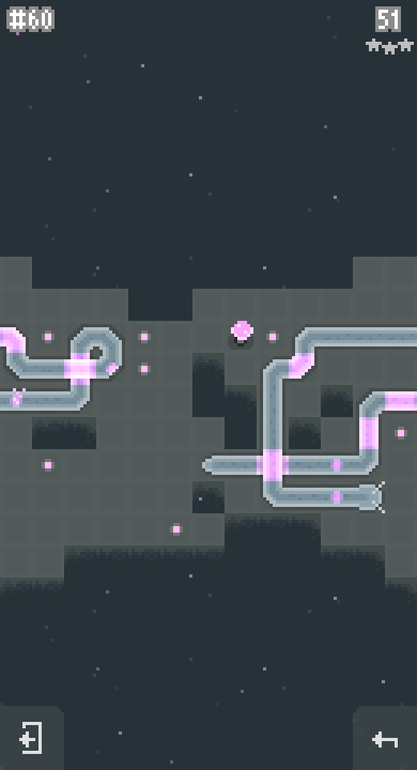
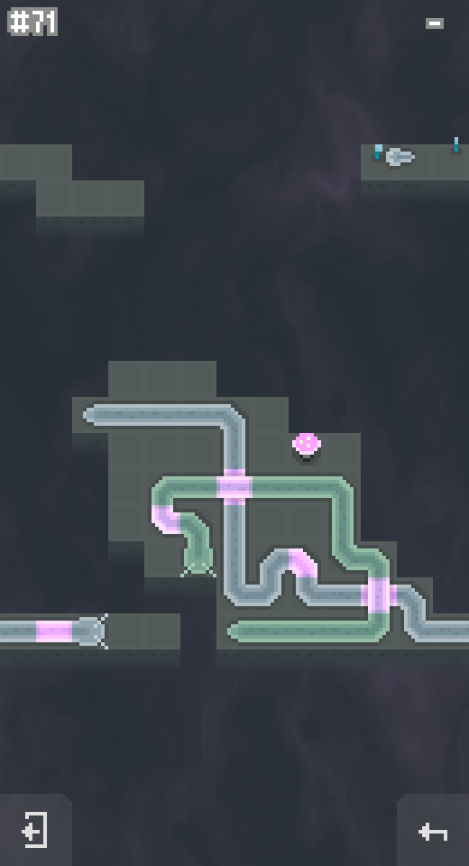
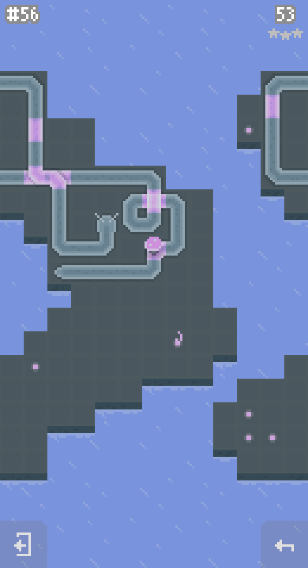

# Tangled Slug

Turn-based puzzle about stretchy slugs that eat mushrooms. Eat all the mushrooms to clear a level, eat them within the allotted number of turns to get 3 stars!

Features:
- Easy to learn, harder to solve
- 100 levels with various puzzle mechanics
- Lots of slugs, lots of skins for them!

Controls:
- WASD, Arrows or Left Mouse Button to move
- R or Backspace to undo your turns
- Hold the undo button to undo all your turns
- ESC to quit

## Links

- [Itch.io](https://erytau.itch.io/tangled-slug) (Windows, Linux, Mac, Android APK)
- [Google Play](https://play.google.com/store/apps/details?id=com.erytau.tangledslug)
- [Ubuntu Snap](https://snapcraft.io/tangled-slug)

## Privacy Policy

- [Privacy Policy](./tangled-slug-privacy)

## Gallery


